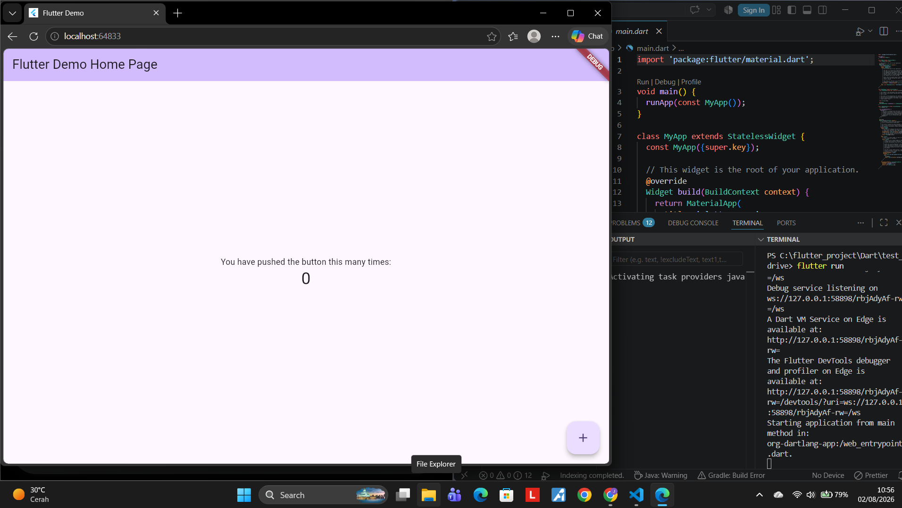
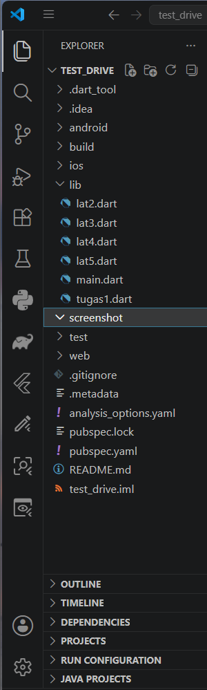
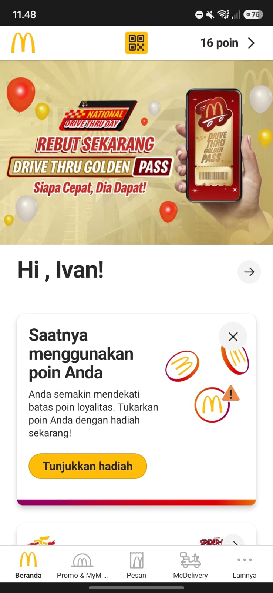
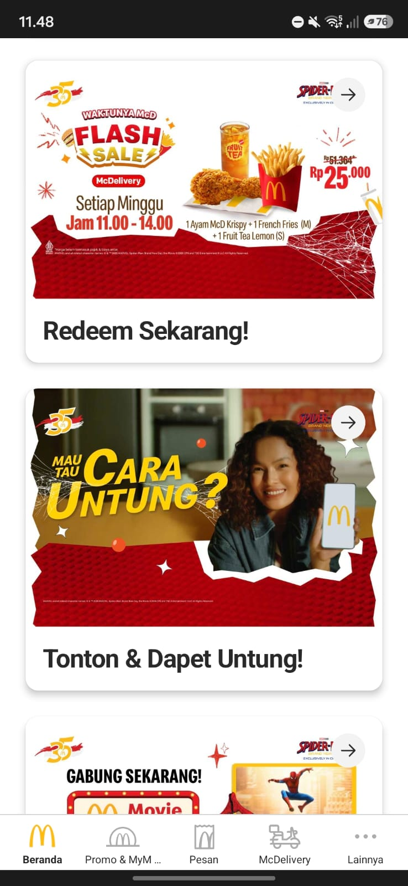

# Tugas Flutter Multi-platform

Berikut adalah bukti bahwa aplikasi sudah berjalan di platform Web:

# Perancangan Aplikasi

Judul Aplikasi : LuxeBite (Sementara, msh belum fix dan bs berubah)

Tagline : Menikmati Kualitas Bintang 5, Menyelamatkan Bumi, Ramah di Kantong.

Deskripsi Utama : LuxeBite adalah sebuah platform inovatif yang dirancang untuk mengatasi masalah limbah makanan (food waste) di industri perhotelan premium. Aplikasi ini menghubungkan hotel bintang 4 dan 5 dengan masyarakat luas—khususnya kalangan mahasiswa dan pekerja—untuk menyelamatkan hidangan prasmanan (buffet) yang belum tersentuh di akhir jam operasional restoran, dengan harga yang sangat terjangkau

Masalah yang diselesaikan : Setiap hari, restoran hotel dengan sistem prasmanan terpaksa membuang puluhan kilogram makanan segar dan berkualitas tinggi yang belum tersentuh oleh tamu demi menjaga standar operasional dan estetika meja makan. Di sisi lain, banyak mahasiswa dan masyarakat yang membutuhkan akses ke makanan bergizi tinggi namun terkendala oleh harga yang mahal

Solusi yang ditawarkan : Melalui konsep "Surprise Bag", pengguna dapat memesan makanan dari hotel favorit mereka pada jam-jam tertentu (misalnya pukul 10:30 pagi setelah sarapan selesai, atau 21:30 malam setelah makan malam). Pengguna tidak dapat memilih menu spesifik, namun dijamin mendapatkan makanan segar berkualitas koki profesional dengan harga miring (diskon hingga 70%-80%)

Keunggulan Teknis : Aplikasi ini ditenagai oleh Firebase Realtime Database untuk memastikan jumlah stok Surprise Bag yang tersedia di setiap hotel diperbarui dalam hitungan milidetik. Hal ini mencegah terjadinya pemesanan ganda ( overselling ) saat banyak pengguna berebut memesan makanan di detik-detik terakhir

List Fitur Utama :
1.Fitur Sisi Pelanggan (User App):
Autentikasi: Login dan Register menggunakan Email/Password atau Google Sign-In.

Dashboard Utama: Menampilkan daftar hotel terdekat yang sedang membuka flash sale "Surprise Bag" beserta sisa porsi dan waktu pengambilan (misal: "Sisa 2 Porsi - Ambil pukul 10.00 - 11.00").

Checkout & Pemesanan: Sistem pemesanan cepat dengan countdown timer (mencegah rebutan barang yang sama di waktu bersamaan).

QR Code Pengambilan: Setelah berhasil memesan, aplikasi men- generate QR Code atau kode unik sebagai bukti pengambilan sah di lobi hotel.

2.Fitur Sisi Pihak Hotel (Admin App/Dashboard):
Manajemen Stok (CRUD): Admin hotel memasukkan jumlah Surprise Bag yang tersedia hari ini setelah jam makan selesai.

Validasi Pesanan: Fitur pemindai kamera atau input manual untuk mengecek dan memvalidasi kode pengambilan pelanggan yang datang.

Komponen Database :
1 users (menyimpan data pengguna) : id, nama, role, email

2 hotels (menyimpan profil hotel dan status penjualan) : id hotel, nama, rating, stok, harga awal, harga diskon, jam pengambilan

3 orders (menyimpan riwayat transkasi) : order id, id pembeli, id hotel, status, pickup code, timestamp

Referensi UI :
1 Warna Utama: menggunakan warna hijau gelap yang melambangkan tentang kepedulian lingkungan dan kemewahan
2 Warna Pendukung: menggunakan warna emas atau gold untuk menunjukkan kualitas kemewahan
3 Background : menggunakan background berwarna putih bersih untuk menunjukkan kesan yang higienis
4 Tipografi huruf : menggunakan font yang bersih dan tegas agar mudah untuk dibaca
5 Layout Utama (Home Page) :
- Pada bagian atas terdapat Greeting seperti "Halo, user" kemudian dilengkapi dengan lokasi pengguna 
- Kemudian dibawahnya terdapat banner foto foto estetik hidangan makanan
- Dibawahnya lagi terdapat List Card yang menampilkan logo hotel, jarak, kemudian harga yang dicoret dan juga progress bar untuk jumlah sisa porsi, jika porsi sisa sedikit maka angkanya akan menjadi warna merah

Disini saya menggunakan app mcd sebagai contoh referensi dari aplikasi yang akan saya buat

6 Halaman Detail hotel :
- Menampilkan deskripsi singkat tentang komitmen zero waste dari hotel tersebut
- Terdapat sebuah kata kata seperti "Isi surprise bag ini adalah hidangan terbaik harini"
- Terdapat sebuah tombol Pesan sekarang

